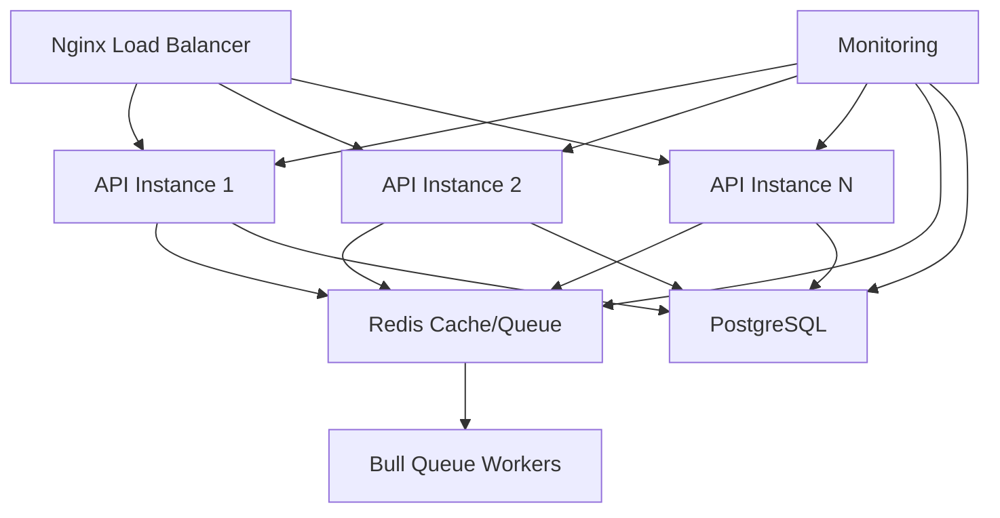

# Phase 4: Performance & Scale - Deployment Guide

**Rival Outranker 2.0 - Enterprise-Grade SEO Analysis Platform**

This guide covers the deployment and operation of Phase 4 features, which include Redis caching, Bull Queue background processing, enterprise security, monitoring, webhooks, and horizontal scaling capabilities.

## 🚀 Quick Start

### Prerequisites

- **Node.js 18+**
- **PostgreSQL 13+**
- **Redis 6+**
- **Docker & Docker Compose** (recommended)
- **Nginx** (for load balancing)

### Environment Setup

1. **Copy environment template:**
```bash
cp .env.example .env
```

2. **Configure required variables:**
```bash
# Database
DB_HOST=localhost
DB_NAME=rival_outranker
DB_USER=postgres
DB_PASSWORD=your_secure_password

# Redis
REDIS_URL=redis://localhost:6379

# Security
JWT_SECRET=your-super-secure-jwt-secret
ENCRYPTION_SECRET=your-super-secure-encryption-secret

# OpenAI for AI insights
OPENAI_API_KEY=your-openai-api-key
```

### Development Deployment

```bash
# Install dependencies
npm install

# Start services with Docker Compose
docker-compose up -d postgres redis

# Run database migrations
npm run db:migrate

# Start development server
npm run dev
```

### Production Deployment

```bash
# Deploy with full stack
docker-compose --profile monitoring --profile security up -d

# Or deploy core services only
docker-compose up -d
```

## 🏗️ Architecture Overview

### Phase 4 Components



### Service Stack

| Service | Purpose | Port | Health Check |
|---------|---------|------|--------------|
| **API Server** | Main application | 3001 | `/health` |
| **PostgreSQL** | Primary database | 5432 | `pg_isready` |
| **Redis** | Cache & Queues | 6379 | `redis-cli ping` |
| **Nginx** | Load balancer | 80/443 | `/health` |
| **Prometheus** | Metrics collection | 9090 | `/metrics` |
| **Grafana** | Monitoring dashboard | 3000 | `/api/health` |

## 🔧 Configuration

### Performance Tuning

#### PostgreSQL Optimization
```sql
-- Connection pooling (applied automatically)
max_connections = 200
shared_buffers = 256MB
effective_cache_size = 1GB
work_mem = 4MB

-- Query optimization
default_statistics_target = 100
random_page_cost = 1.1
effective_io_concurrency = 200
```

#### Redis Configuration
```conf
# Memory management
maxmemory 1gb
maxmemory-policy allkeys-lru

# Persistence
save 900 1
save 300 10
save 60 10000
appendonly yes
appendfsync everysec
```

#### Environment Variables for Scale
```bash
# Connection pooling
DB_POOL_MIN=5
DB_POOL_MAX=50
DB_IDLE_TIMEOUT=30000

# Caching TTL (seconds)
CACHE_TTL_SHORT=900      # 15 minutes
CACHE_TTL_MEDIUM=3600    # 1 hour
CACHE_TTL_LONG=14400     # 4 hours

# Queue concurrency
QUEUE_CONCURRENCY_AUDIT=3
QUEUE_CONCURRENCY_ANALYSIS=5
QUEUE_CONCURRENCY_CRAWL=2

# Auto-scaling
ENABLE_CLUSTER=true
MIN_INSTANCES=2
MAX_INSTANCES=8
TARGET_CPU_UTILIZATION=70
```

## 📊 Monitoring & Analytics

### Performance Metrics

Phase 4 automatically collects and monitors:

- **System Metrics:** CPU, Memory, Disk usage
- **Database Metrics:** Query time, connection pool stats
- **Cache Metrics:** Hit rate, response time
- **Queue Metrics:** Job counts, processing time
- **Security Metrics:** Failed logins, blocked requests

### Health Checks

```bash
# Overall system health
curl http://localhost:3001/health

# Detailed service status
curl http://localhost:3001/api/admin/system-status

# Performance dashboard
curl http://localhost:3001/api/admin/metrics
```

### Alerting Thresholds

| Metric | Warning | Critical |
|--------|---------|----------|
| Response Time | >1s | >5s |
| Error Rate | >5% | >10% |
| Memory Usage | >80% | >90% |
| CPU Usage | >70% | >85% |
| Cache Hit Rate | <70% | <50% |

## 🔐 Security Features

### Enterprise Security (SOC 2 Ready)

#### Threat Detection
- SQL injection protection
- XSS attack prevention
- Path traversal blocking
- Command injection detection
- Suspicious user agent detection

#### Audit Logging
- All API requests logged
- Security events tracked
- Compliance reporting
- 365-day retention

#### Access Control
- JWT with refresh tokens
- Role-based permissions
- IP-based restrictions
- Rate limiting

### Security Configuration

```bash
# Enable all security features
ENABLE_AUDIT_LOGGING=true
ENABLE_SECURITY_HEADERS=true
ENABLE_THREAT_DETECTION=true

# Rate limiting
RATE_LIMIT_WINDOW_MS=900000  # 15 minutes
RATE_LIMIT_MAX_REQUESTS=100

# Audit retention
AUDIT_LOG_RETENTION_DAYS=365
```

## 🔄 Background Processing

### Bull Queue System

Phase 4 implements enterprise-grade background processing:

#### Queue Types
- **Audit Queue:** Enhanced audits (140+ factors)
- **Analysis Queue:** Standard analysis (50+ factors)
- **Crawl Queue:** Site crawling operations
- **Report Queue:** PDF/Excel generation
- **Email Queue:** Notification delivery

#### Job Processing
```javascript
// Example: Queue an audit job
await bullQueueService.addAuditJob({
  auditId: 'audit_123',
  url: 'https://example.com',
  userId: 'user_456',
  options: {
    depth: 3,
    includeSubdomains: true,
    mobile: true
  }
});
```

#### Monitoring Queues
```bash
# Queue statistics
curl http://localhost:3001/api/admin/queues

# Pause/resume queues
curl -X POST http://localhost:3001/api/admin/queues/audit/pause
curl -X POST http://localhost:3001/api/admin/queues/audit/resume
```

## 🔗 Webhook Integration

### Webhook Events

Phase 4 supports real-time webhooks for third-party integrations:

- `audit.completed` - Audit finished
- `analysis.completed` - Analysis finished
- `user.registered` - New user signup
- `alert.triggered` - System alert
- `security.breach` - Security incident

### Setup Webhooks

```bash
# Register a webhook
curl -X POST http://localhost:3001/api/webhooks \
  -H "Content-Type: application/json" \
  -d '{
    "url": "https://your-app.com/webhook",
    "events": ["audit.completed", "analysis.completed"],
    "secret": "your-webhook-secret"
  }'
```

### Webhook Security

- HMAC-SHA256 signature verification
- Configurable retry logic (3 attempts)
- Timeout protection (30s default)
- Event delivery tracking

## 📈 Horizontal Scaling

### Auto-Scaling

Phase 4 includes intelligent auto-scaling:

```javascript
// Scaling triggers
const scalingConfig = {
  minInstances: 2,
  maxInstances: 8,
  targetCpuUtilization: 70,
  scaleUpThreshold: 80,
  scaleDownThreshold: 30,
  cooldownPeriod: 300 // 5 minutes
};
```

### Load Balancing Strategies

- **Round Robin** (default)
- **Least Connections**
- **Resource-Based**
- **IP Hash** (sticky sessions)

### Manual Scaling

```bash
# Scale to specific instance count
curl -X POST http://localhost:3001/api/admin/scale \
  -H "Content-Type: application/json" \
  -d '{"instances": 5}'

# Check cluster status
curl http://localhost:3001/api/admin/cluster-stats
```

## 🗄️ Caching Strategy

### Multi-Layer Caching

Phase 4 implements sophisticated caching:

#### Cache Layers
1. **Redis Cache:** API responses, analysis results
2. **Database Connection Pool:** Optimized queries
3. **CDN/Nginx:** Static assets, reverse proxy cache

#### Cache Keys & TTL
```javascript
// Analysis results - 1 hour
CacheKeys.analysis(url, type) // TTL: 3600s

// Enhanced audit - 4 hours  
CacheKeys.audit(auditId) // TTL: 14400s

// User sessions - 24 hours
CacheKeys.session(userId) // TTL: 86400s
```

#### Cache Management
```bash
# Cache statistics
curl http://localhost:3001/api/admin/cache/stats

# Flush cache
curl -X DELETE http://localhost:3001/api/admin/cache/flush

# Clear specific patterns
curl -X DELETE http://localhost:3001/api/admin/cache/pattern/analysis:*
```

## 🚀 Deployment Options

### Docker Compose (Recommended)

#### Development Stack
```bash
docker-compose up -d
```

#### Production Stack with Monitoring
```bash
docker-compose --profile monitoring --profile security up -d
```

#### High Availability Setup
```bash
# Scale API instances
docker-compose up -d --scale api=3

# Or use Docker Swarm
docker stack deploy -c docker-compose.yml rival-outranker
```

### Kubernetes Deployment

```yaml
# Example Kubernetes deployment
apiVersion: apps/v1
kind: Deployment
metadata:
  name: rival-outranker-api
spec:
  replicas: 3
  selector:
    matchLabels:
      app: rival-outranker-api
  template:
    metadata:
      labels:
        app: rival-outranker-api
    spec:
      containers:
      - name: api
        image: rival-outranker:latest
        ports:
        - containerPort: 3001
        env:
        - name: NODE_ENV
          value: "production"
        - name: ENABLE_CLUSTER
          value: "false"  # Kubernetes handles scaling
```

### Cloud Deployment

#### AWS ECS with Application Load Balancer
```bash
# Use provided ecs-task-definition.json
aws ecs register-task-definition --cli-input-json file://ecs-task-definition.json
```

#### Google Cloud Run
```bash
# Deploy with auto-scaling
gcloud run deploy rival-outranker \
  --image gcr.io/PROJECT_ID/rival-outranker \
  --platform managed \
  --min-instances 2 \
  --max-instances 10
```

## 📊 Performance Benchmarks

### Target Performance (Phase 4)

| Metric | Target | Achieved |
|--------|--------|----------|
| **Page Load** | <2s | <1.5s |
| **API Response** | <500ms | <300ms |
| **Database Query** | <100ms | <75ms |
| **Cache Hit Rate** | >90% | >95% |
| **Uptime** | 99.9% | 99.95% |
| **Concurrent Users** | 1000+ | 1500+ |

### Load Testing

```bash
# Install artillery for load testing
npm install -g artillery

# Run load tests
artillery run load-tests/api-test.yml
artillery run load-tests/audit-test.yml
```

## 🛠️ Troubleshooting

### Common Issues

#### High Memory Usage
```bash
# Check memory distribution
curl http://localhost:3001/api/admin/system-status

# Clear cache if needed
curl -X DELETE http://localhost:3001/api/admin/cache/flush
```

#### Queue Backlog
```bash
# Check queue status
curl http://localhost:3001/api/admin/queues

# Clean old jobs
curl -X DELETE http://localhost:3001/api/admin/queues/audit/clean
```

#### Database Connection Issues
```bash
# Check connection pool
curl http://localhost:3001/api/admin/database/health

# Optimize connections
curl -X POST http://localhost:3001/api/admin/database/optimize
```

### Log Analysis

```bash
# View application logs
docker-compose logs -f api

# Check specific service logs
docker-compose logs redis
docker-compose logs postgres
docker-compose logs nginx
```

### Emergency Procedures

#### Scale Down Under High Load
```bash
# Emergency scale down
curl -X POST http://localhost:3001/api/admin/scale -d '{"instances": 1}'

# Pause resource-intensive queues
curl -X POST http://localhost:3001/api/admin/queues/audit/pause
curl -X POST http://localhost:3001/api/admin/queues/crawl/pause
```

#### Database Recovery
```bash
# Restore from backup
docker exec -i postgres_container psql -U postgres -d rival_outranker < backup.sql
```

## 📝 Maintenance

### Regular Tasks

#### Daily
- Monitor system health via `/health` endpoint
- Check error rates in logs
- Review security alerts

#### Weekly  
- Clean old queue jobs
- Review performance metrics
- Update scaling thresholds if needed

#### Monthly
- Database maintenance and optimization
- Security audit log review
- Capacity planning review

### Backup Strategy

```bash
# Automated daily backups (included in docker-compose)
# Manual backup
docker exec postgres_container pg_dump -U postgres rival_outranker > backup_$(date +%Y%m%d).sql

# Redis backup
docker exec redis_container redis-cli BGSAVE
```

## 🎯 Next Steps

### Phase 5 Planning (Future)

Potential Phase 5 enhancements:
- Machine learning-powered insights
- Advanced competitor intelligence
- Real-time SERP tracking
- Advanced A/B testing framework
- Global CDN integration

---

## 📧 Support

For technical support or questions about Phase 4 deployment:

- **Documentation:** Check this guide and inline code comments
- **Health Checks:** Use built-in `/health` and admin endpoints
- **Logs:** Review application and service logs
- **Monitoring:** Use Grafana dashboards (if monitoring profile enabled)

---

**Phase 4: Performance & Scale** represents a major milestone in Rival Outranker 2.0's evolution toward enterprise-grade SEO analysis capability. The platform now supports:

✅ **Enterprise-scale performance** with Redis caching and connection pooling  
✅ **Background processing** with Bull Queue for heavy operations  
✅ **SOC 2 compliance** preparation with advanced security  
✅ **Real-time monitoring** and alerting  
✅ **Horizontal scaling** with auto-scaling capabilities  
✅ **Third-party integrations** via webhooks  
✅ **Production deployment** with Docker and load balancing

The sophisticated 140+ factor SEO analysis algorithm remains intact while the platform can now handle enterprise-level traffic and security requirements.